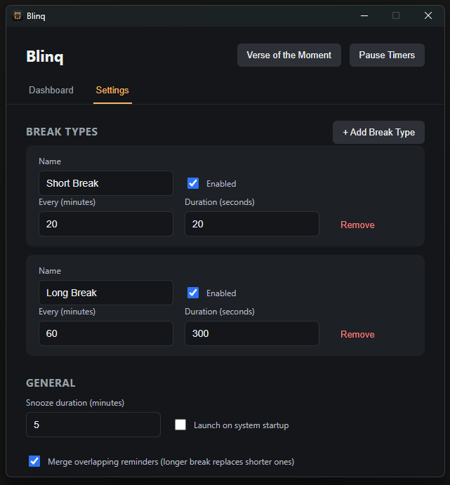
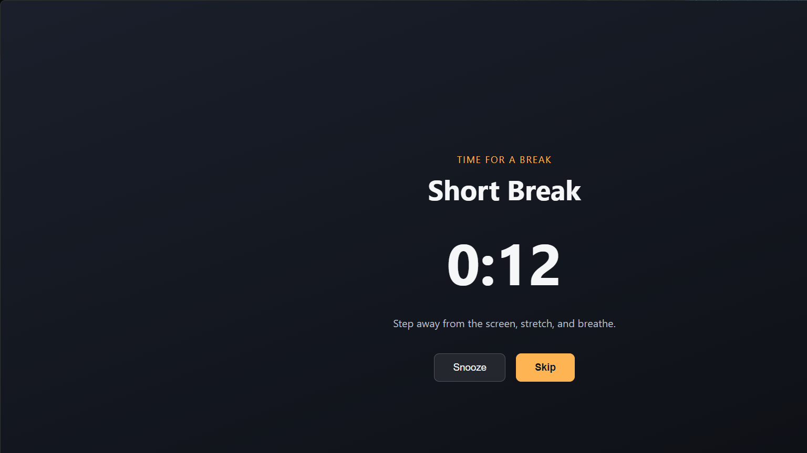

# Blinq

A lightweight Windows desktop app that reminds you to take breaks at intervals you configure. Set up as many break types as you like — a short eye-rest break every 20 minutes, a longer stretch break every hour — and it'll nudge you with a full-screen reminder when it's time.

<p align="center">
  
  &nbsp;&nbsp;
  
</p>

## Features

- Configurable break types, each with its own interval and duration
- Full-screen reminder with a countdown, plus Snooze and Skip
- System tray icon showing time remaining until your next break
- Pause/Resume all timers (e.g. during meetings)
- Launch automatically at Windows startup
- Runs quietly in the tray — closing the window doesn't quit the app

## Install

Requires [Node.js](https://nodejs.org/) 18+ and npm.

```bash
git clone <this-repo-url>
cd break-reminder
npm install
```

## Usage

### Run in development

```bash
npm run dev
```

This starts the app with hot reload for the renderer.

### Build a Windows installer

```bash
npm run dist
```

This produces an NSIS installer in `dist/`. Run the installer, and Blinq will be available as a regular Windows app.

### Using the app

1. On launch, the **Settings** window opens with two default break types: a 20-minute "Short Break" and a 60-minute "Long Break".
2. Add, edit, or remove break types under **Break Types** — set the name, how often it repeats (minutes), and how long the break lasts (seconds).
3. When a break is due, a full-screen reminder appears with a countdown. Click **Skip** to end it early, or **Snooze** to postpone it (snooze length is configurable under **General**).
4. Use the tray icon (bottom-right of your taskbar) to **Pause/Resume** timers, reopen **Settings**, or **Quit** the app entirely.
5. Closing the Settings window just hides it — the app keeps running and reminding you from the tray. Use **Quit** from the tray menu to fully exit.
6. Enable **Launch on system startup** under **General** to have Blinq start automatically when you log in.

Settings are saved automatically and persist across restarts.

## Tech stack

Electron + React + TypeScript, built with [electron-vite](https://electron-vite.org/) and packaged with [electron-builder](https://www.electron.build/).
